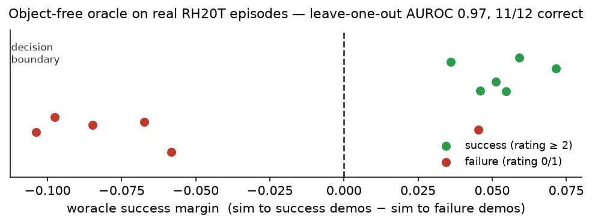
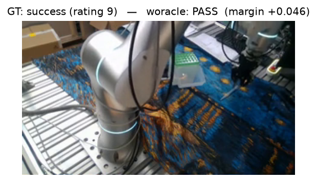
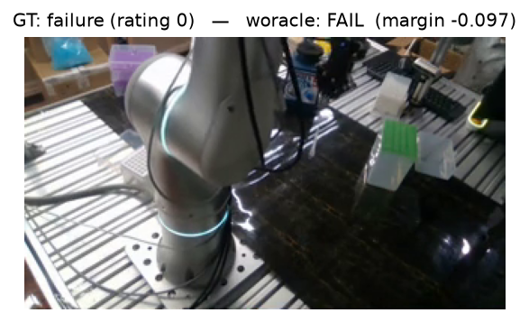

# Woracle

**The world-model oracle. Demos in, oracle out.**

[](https://github.com/ZoreAnuj/Woracle/actions/workflows/ci.yml)
[](LICENSE)


A simulator hands you `success()` for free. A world model — or a raw camera —
hands you only pixels: no object poses, no contact flags, no success function. So
today every robot-policy evaluation hand-rolls a per-task success detector, and
those sit at 65–80% accuracy with no abstention and no statistics.

Woracle **compiles the oracle from a few demonstrations instead.** Give it a task
prompt and a handful of labeled episodes; it judges new rollouts — from any world
model or real video — and abstains when it honestly cannot tell.

---

## How it works

```
  "insert the pipette tip into the holder"        rollouts to judge
   + a few demos (success & failure)              (any world model, or real video)
              │                                            │
              ▼                                            ▼
        ┌──────────┐                       ┌────────┐  ┌──────┐  ┌───────┐  ┌───────┐
        │ COMPILE  │ ── task spec ───────▶ │ GROUND │─▶│ GATE │─▶│ GRADE │─▶│ STATS │
        └──────────┘   roles · success     └────────┘  └──────┘  └───────┘  └───────┘
                       criteria · demos     read the    abstain   pass /     honest
                                            scene        if it     fail +     rankings
                                            (objects,    cannot    margin     + CIs,
                                             or whole-   judge                abstention
                                             frame)                           accounting
                                                            └──▶ grade card · leaderboard
```

The honest defaults are the point: woracle **abstains when it cannot perceive the
evidence** rather than guessing, reports abstention as information, and never lets
a ranking-only signal touch a success verdict.

---

## Results

Judging **real RH20T pipette-insertion episodes** — 6 human-rated successes and 6
human-rated failures — with **no privileged information** and **no per-task tuning**:



| oracle | how it perceives | graded | correct | AUROC |
|---|---|---:|---:|---:|
| object-grounded (GroundingDINO + SAM) | detect the tip by name | **0 / 12** | — | — |
| **object-free** (DINOv2 demo-matching) | embed the whole frame | **12 / 12** | **11 / 12** | **0.97** |

The ~10 px pipette tip is below the detector's resolution floor, so the
object-grounded path **abstains on everything**. The object-free oracle —
similarity to success vs. failure demos — separates the two classes cleanly
(leave-one-out). The single miss is a subtle *task* failure (rating 1) whose final
frame looks like a success; a temporal or reward-model channel closes that gap.

### Sample judgments (ground truth vs. woracle)

| | |
|---|---|
|  |  |

Real frames, real human ratings, real predictions — produced without ever
detecting the manipulated object.

---

## Quickstart

```bash
uv sync --group test           # or: pip install -e . --group test
woracle demo --out blob_demo   # a synthetic world with known ground truth
woracle grade --rollouts blob_demo --spec blob_demo/spec.yaml --out out
woracle report --cards out/cards --out leaderboard.md
```

`blob_demo` contains a success, two failure modes, a *vanish* episode (the world
model deleted the object — woracle abstains, and says why), and a random policy.
No GPU, no checkpoints, no network.

### Library — the four verbs

```python
import woracle

# compile an oracle from demos (self-tested, or it REFUSES rather than emit a bad one)
spec  = woracle.compile("demos/", "insert the pipette tip into the holder",
                        out="specs/insert.yaml")

bundles = woracle.ground("rollouts/", spec)        # bind the scene (objects, or whole-frame)
cards   = woracle.grade("rollouts/", spec, out_dir="out")
board   = woracle.report(cards, "leaderboard.md",
                         golds="labels.json",       # optional: PPI-rectified success rates
                         html_path="report.html")   # abstain-aware, MNAR-bounded
```

---

## The stages

| | |
|---|---|
| **S1 Compile** | prompt + demos → a portable task spec (relational roles, success criteria); self-tested against the demos or it refuses |
| **S2 Ground** | bind the spec to a rollout — open-vocab detect + track when objects are perceivable, or whole-frame embedding when they are not |
| **S3 Gate** | structural validity check (object permanence, drift, action↔video consistency) → grade, degrade, or **abstain** |
| **S4 Grade** | scored channels (predicate success, demo-match, progress, trajectory) fused into a verdict; ranking-only signals are walled off |
| **S5 Stats** | PPI-rectified success rates, MNAR abstention bounds, bootstrap rank intervals — honest numbers, with CIs |

The kernel rule: `import woracle` pulls numpy + pydantic only (CI-enforced). Heavy
stacks (detectors, encoders, VLMs) live behind extras and load lazily at call time.

---

## Design and evidence

- [`studies/wm_test/GROUNDING_FIX.md`](studies/wm_test/GROUNDING_FIX.md) — why
  detection-keyed grounding fails on small objects, the literature on object-free
  success judging, and the fix validated above
- [`studies/binding/REPORT.md`](studies/binding/REPORT.md) — measured grounding
  behaviour on real world-model rollouts
- [`docs/PLUGINS.md`](docs/PLUGINS.md) — write your own grounder, gate signal,
  channel, or judge; run the conformance suite in your CI

## License

Apache-2.0.
